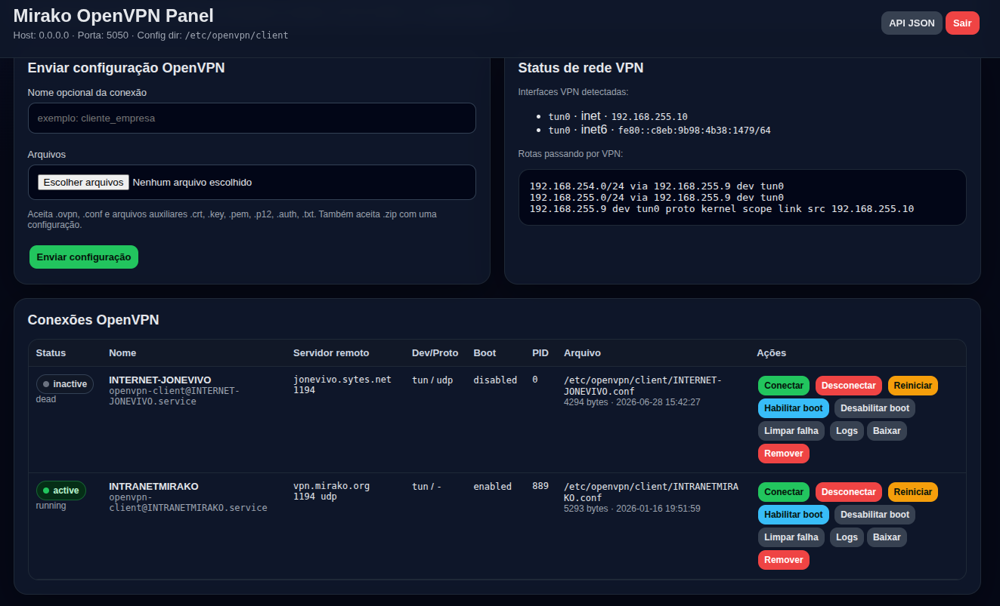

# Mirako OpenVPN Panel

Painel web single-file em Flask para gerenciar conexões OpenVPN client via systemd, com controle de NAT/iptables para compartilhamento de internet em dois modos: **através da VPN** ou **internet normal (bypassando a VPN)**.

## Screenshots



## Funcionalidades

- Upload de configurações `.ovpn`/`.conf` e arquivos auxiliares (crt, key, pem, p12, auth) — inclusive via `.zip`
- Gerenciamento de serviços systemd: `start`, `stop`, `restart`, `enable`, `disable`, `reset-failed`
- Visualização de logs em tempo real via `journalctl`
- **Modo VPN**: compartilha internet de uma interface LAN para clientes roteando o tráfego pela interface VPN (iptables MASQUERADE + FORWARD)
- **Modo Normal**: compartilha internet sem passar pela VPN, usando policy routing (ip rule table 100) para bypassar o redirect-gateway da VPN
- Diagnóstico completo de rede: rotas, interfaces, firewall, ping, policy routing
- Saúde do servidor via endpoint `/health` (sem autenticação)
- Backup automático de configurações antes de alterações
- CSRF protection customizada
- Interface web responsiva em português (PT-BR)

## Requisitos

- **Python 3.6+** com `flask`
- **systemd** (para gerenciamento dos serviços OpenVPN)
- **iptables** (para NAT/compartilhamento)
- **iproute2** (`ip` command)
- **OpenVPN** instalado (os serviços usam `openvpn-client@.service`)
- Acesso **root** para start/stop de serviços e manipulação de iptables

## Instalação

```bash
# Instalar dependências de sistema (iptables, iproute2, OpenVPN)
sudo apt update
sudo apt install -y iptables iproute2 openvpn

# Instalar dependências Python
pip install flask

# Clonar ou copiar o arquivo
sudo cp openVPN.py /opt/openvpn-panel/
sudo chmod +x /opt/openvpn-panel/openVPN.py
```

> **Nota:** O OpenVPN já instala o template systemd `openvpn-client@.service` necessário para o painel gerenciar as conexões. Verifique com `systemctl list-unit-files | grep openvpn-client`.

## Configuração via variáveis de ambiente

| Variável                        | Padrão                             | Descrição                                                               |
| ------------------------------- | ---------------------------------- | ----------------------------------------------------------------------- |
| `OPENVPN_PANEL_USER`            | `admin`                            | Usuário de login                                                        |
| `OPENVPN_PANEL_PASSWORD`        | `admin123`                         | Senha de login **(mude em produção!)**                                  |
| `OPENVPN_PANEL_SECRET`          | aleatório                          | Chave secreta da sessão Flask                                           |
| `OPENVPN_PANEL_HOST`            | `0.0.0.0`                          | Endereço de bind                                                        |
| `OPENVPN_PANEL_PORT`            | `5050`                             | Porta HTTP                                                              |
| `OPENVPN_CONFIG_DIR`            | `/etc/openvpn/client`              | Diretório dos arquivos `.conf`                                          |
| `OPENVPN_BACKUP_DIR`            | `/var/backups/openvpn-panel`       | Diretório de backups                                                    |
| `OPENVPN_PANEL_MAX_UPLOAD_MB`   | `32`                               | Tamanho máximo de upload                                                |
| `OPENVPN_SHARE_LAN_IF`          | `""`                               | Interface LAN que entrega internet aos clientes (ex: `wlan0`, `eth1`)   |
| `OPENVPN_SHARE_VPN_IF`          | `auto`                             | Interface VPN de saída. `auto` detecta tun/tap/ovpn automaticamente     |
| `OPENVPN_AUTO_SHARE_ON_START`   | `0`                                | Aplica NAT automaticamente ao conectar/reiniciar VPN                    |
| `OPENVPN_NORMAL_WAN_IF`         | `end0`                             | Interface WAN para internet normal                                      |
| `OPENVPN_NORMAL_LAN_IF`         | valor de `SHARE_LAN_IF` ou `wlan0` | Interface LAN para internet normal                                      |
| `OPENVPN_NORMAL_GATEWAY`        | `""`                               | Gateway IPv4 manual para modo normal (vazio = detectar automaticamente) |
| `OPENVPN_NORMAL_ROUTE_TABLE`    | `100`                              | Tabela de roteamento para policy route do modo normal                   |
| `OPENVPN_NORMAL_ROUTE_PRIORITY` | `10010`                            | Prioridade da policy route                                              |

### Exemplo mínimo

```bash
export OPENVPN_PANEL_USER=admin
export OPENVPN_PANEL_PASSWORD=senha_segura
export OPENVPN_CONFIG_DIR=/etc/openvpn/client
export OPENVPN_SHARE_LAN_IF=wlan0

python3 openVPN.py
```

## Execução

```bash
# Recomendado: rodar como root para ter acesso a systemctl e iptables
sudo python3 openVPN.py

# Ou em background com nohup
sudo nohup python3 openVPN.py > /var/log/openvpn-panel.log 2>&1 &

# Ou como serviço systemd (criar /etc/systemd/system/openvpn-panel.service)
```

### Banner de inicialização

Ao iniciar, o painel exibe:

```
Mirako OpenVPN Panel iniciado.
URL: http://0.0.0.0:5050
Usuário: admin
LAN compartilhada padrão VPN: wlan0
VPN padrão: auto
Auto NAT ao conectar: False
WAN normal padrão: end0
LAN normal padrão: wlan0
Gateway normal padrão: auto
Tabela policy route normal: 100
ATENÇÃO: senha padrão em uso: admin123
```

## Rotas HTTP

| Método     | Rota                      | Autenticação | Descrição                                                    |
| ---------- | ------------------------- | ------------ | ------------------------------------------------------------ |
| `GET`      | `/health`                 | Não          | Health check JSON: `{"ok": true, "app": "...", "time": ...}` |
| `GET/POST` | `/login`                  | Não          | Página de login                                              |
| `GET`      | `/logout`                 | Sim          | Logout                                                       |
| `GET`      | `/`                       | Sim          | Dashboard principal                                          |
| `GET`      | `/api/status`             | Sim          | Status completo em JSON                                      |
| `POST`     | `/share`                  | Sim          | Ações de NAT/compartilhamento                                |
| `POST`     | `/upload`                 | Sim          | Upload de configuração                                       |
| `POST`     | `/config/<name>/<cmd>`    | Sim          | Ações no serviço                                             |
| `GET`      | `/config/<name>/logs`     | Sim          | Logs do serviço                                              |
| `GET`      | `/config/<name>/logs/raw` | Sim          | Logs em texto puro                                           |
| `GET`      | `/config/<name>/download` | Sim          | Download do arquivo `.conf`                                  |

### Ações de compartilhamento (`POST /share`)

| `action`         | Descrição                                       |
| ---------------- | ----------------------------------------------- |
| `enable`         | Ativar compartilhamento pela VPN (iptables NAT) |
| `disable`        | Remover regras de compartilhamento VPN          |
| `normal`         | Voltar para internet normal (bypass VPN)        |
| `normal_reverse` | Inverter WAN/LAN no modo normal                 |
| `normal_disable` | Remover regras do modo normal                   |
| `wan_dhcp`       | Renovar IPv4 da interface WAN via DHCP          |
| `save`           | Salvar regras iptables no boot                  |

### Comandos de configuração (`POST /config/<name>/<cmd>`)

| `cmd`          | Descrição                                 |
| -------------- | ----------------------------------------- |
| `start`        | Iniciar conexão OpenVPN                   |
| `stop`         | Parar conexão                             |
| `restart`      | Reiniciar conexão                         |
| `enable`       | Habilitar inicialização automática (boot) |
| `disable`      | Desabilitar inicialização automática      |
| `reset_failed` | Limpar estado de falha do systemd         |
| `delete`       | Parar, desabilitar e remover configuração |

## Endpoints JSON

### `GET /api/status`

Retorna JSON completo com:

- Lista de configurações e seus estados
- Status do compartilhamento VPN
- Status do modo normal
- Diagnóstico de rede
- Interfaces detectadas
- Avisos de preflight

## Arquitetura

### Estrutura de arquivos

```
openVPN.py           # Aplicação completa (Flask + HTML + lógica)
AGENTS.md            # Instruções para agents/LLMs
```

**Não há** diretórios `templates/`, `static/` ou `requirements.txt`. O HTML é renderizado via `render_template_string` com três templates embutidos: `LOGIN_HTML`, `DASHBOARD_HTML`, `LOGS_HTML`.

### Armazenamento de configurações

- Arquivos `.conf` salvos em `OPENVPN_CONFIG_DIR` (padrão: `/etc/openvpn/client/`)
- Nome sanitizado com `secure_filename` + validação regex `^[A-Za-z0-9_.-]{1,64}$`
- Permissão `0o600` após upload
- Backups automáticos em `OPENVPN_BACKUP_DIR` antes de qualquer sobrescrita

### Gerenciamento de serviços

Cada configuração vira um serviço systemd:

```
openvpn-client@<nome>.service
```

### Modos de compartilhamento

**Modo VPN:**

```
LAN (ex: wlan0) → iptables FORWARD → VPN (ex: tun0) → internet
```

Regras: MASQUERADE na saída VPN, FORWARD liberado, TCP MSS clamp.

**Modo Normal (bypass VPN):**

```
LAN (ex: wlan0) → iptables FORWARD → WAN (ex: end0) → internet
```

Além do NAT, cria policy routing (`ip rule` tabela 100) para clientes da LAN bypassarem o redirect-gateway da VPN.

## Segurança

- **CSRF**: token customizado armazenado na sessão, validado por `hmac.compare_digest`
- **Autenticação**: sessão Flask com `secret_key` configurável via env
- **Senha padrão**: o painel exibe um aviso no startup se a senha for `admin123`
- **Upload restrito**: apenas extensões permitidas; paths sanitizados contra path traversal
- **Root necessário**: systemctl e iptables exigem privilégios elevados

## Upload de configurações

### Arquivos permitidos

- **Configuração**: `.ovpn`, `.conf`
- **Auxiliares**: `.crt`, `.key`, `.pem`, `.p12`, `.txt`, `.auth`, `.pass`, `.ca`, `.tlsauth`
- **Compactado**: `.zip` (deve conter exatamente uma configuração + opcionais auxiliares)

### Regras

1. Exatamente um arquivo `.ovpn` ou `.conf` deve ser enviado (ou dentro do ZIP)
2. Arquivos auxiliares são opcionais e salvos no mesmo diretório
3. ZIPs são extraídos com proteção contra path traversal (`clean_zip_member_path`)

## Diagnóstico de rede

O painel executa diagnostics não-invasivos:

- `ip route get 8.8.8.8` (rota do servidor)
- `ip route get 8.8.8.8 from <lan_ip> iif <lan_if>` (rota simulando cliente)
- Ping IPv4 para `8.8.8.8` e `google.com`
- Snapshots de interfaces, rotas, regras de firewall, policy routing
- Leitura de `resolv.conf`
- Se `nft` estiver presente, lista o ruleset do nftables

## Troubleshooting

### "Senha padrão em uso"

Defina `OPENVPN_PANEL_PASSWORD` com uma senha segura.

### "O painel não está rodando como root"

Execute com `sudo` ou como root para permitir systemctl e iptables.

### "iptables não encontrado"

```bash
sudo apt install iptables
```

### "systemd não parece estar ativo"

O painel requer systemd. Verifique se `/run/systemd/system` existe.

### "auth-user-pass sem arquivo"

A configuração `.ovpn` contém `auth-user-pass` sem um arquivo de credenciais. Adicione um arquivo `.auth` com usuário/senha ou edite a config.

### Logs da conexão

Acesse `/config/<nome>/logs` no painel ou use `journalctl -u openvpn-client@<nome>.service` diretamente.

## API de saúde

```bash
curl http://localhost:5050/health
# {"ok": true, "app": "Mirako OpenVPN Panel", "time": 1712345678}
```

## Licença

Uso interno. Sem garantias.
